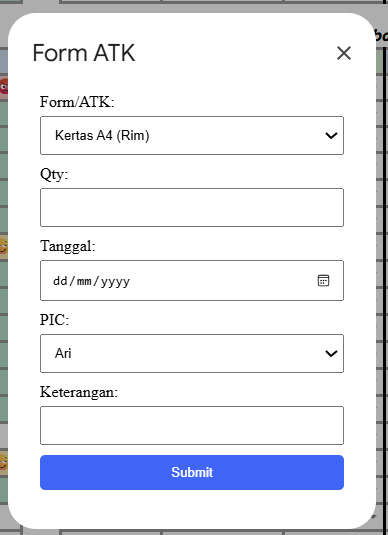

# ATK Stock Management System (Google Apps Script)

# Use Case
Used internally to manage ATK stock and streamline request processes in daily operations.

## Description
Web-based form to handle ATK (office supplies) requests using Google Apps Script.

## Features
- Input form (item, qty, date, PIC, notes)
- Form validation
- SweetAlert notification
- Auto submit to Google Sheets

## Preview
### Form Input

## Tools
- Google Apps Script
- HTML, CSS, JavaScript

## Impact
- Reduces manual data entry
- Improves reporting efficiency
- Minimizes human error in stock tracking
